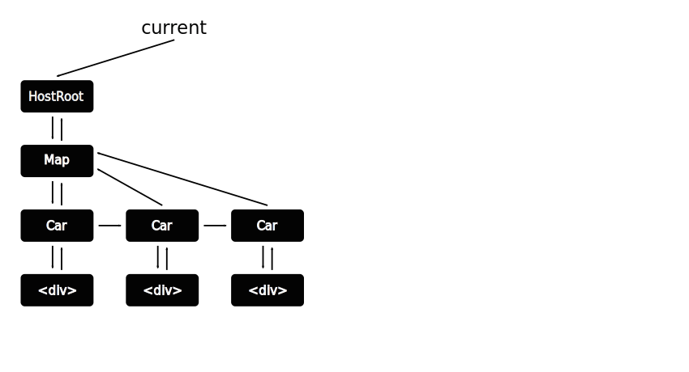
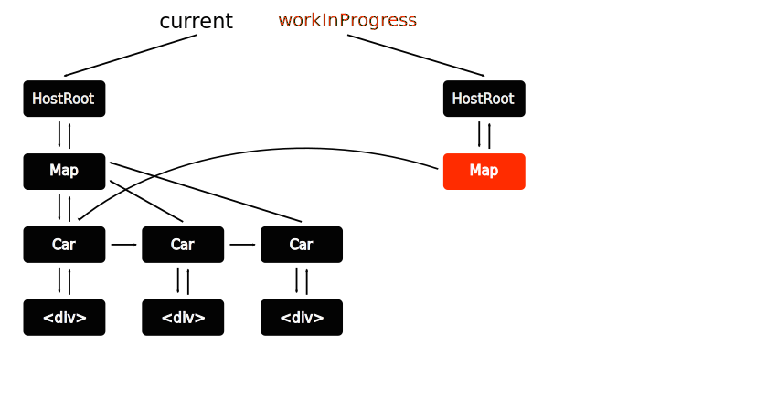
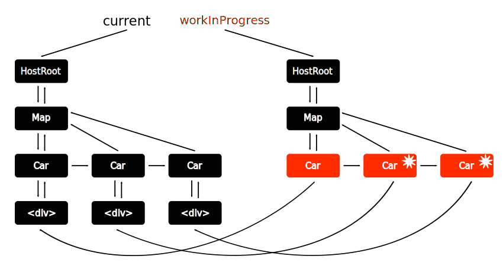
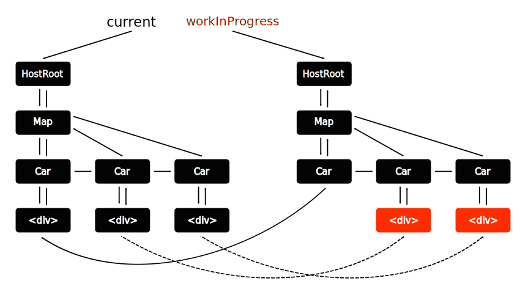
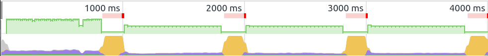
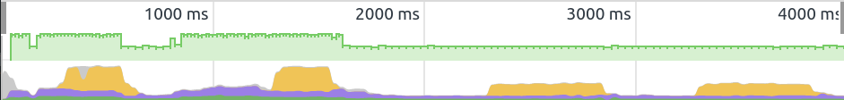

# React 16 (fiber і далі)

Опубліковано на [DOU](https://dou.ua/lenta/articles/react-fiber/) 29.09.2017

Я [Євген Шемет](https://github.com/yevhene) - професійно займаюсь розробкою більше 10-ти років, виступаю на конференціях, організовую IT мітапи, викладаю у благодійній фундації BrainBasket та з цього навчального року у ВНТУ. Я доповідав на [vinnytsia.js](http://vinnytsiajs.org/) [про React 16](https://present-fiber.herokuapp.com/). І мене нещодавно запросили написати, на цю тему, статтю для Dou. Статтю пишу вперше, тому буду радий вашим зауваженням та порадам у особистих повідомленнях або коментарях.

## Fiber
Це нова архітектура, що покладена в основу React 16. Реліз якого [відбувся нещодавно](https://facebook.github.io/react/blog/2017/09/26/react-v16.0.html). Велика частина коду була переписана з нуля. Основною метою було створення можливості для пріоритизації оновлень контенту. Також переписана система обробки помилок та усунуті деякі старі незручності, наприклад, необхідність обгортати декілька елементів в один кореневий елемент. Існуюче API, на щастя, майже не зачіпили.

## [Демо](https://present-fiber-demo.herokuapp.com/)
Розпочати знайомство краще всього з проблеми, яку має вирішити нова версія. Її добре видно на демо. Демо синтетичне, симулює щось накшталт екрану диспетчерської таксі. На карті міста жовті машини. На машинах чорні числа, що вказують скільки машині ще їхати до точки призначення. Числа змінюються кожної секунди, і під час цієї зміни, анімація підлагує. Лаги з'являються тому, що виконується дві паралельні дії: обробка анімації та оновлення DOM. Анімація працює добре аж до поки не стається масоване оновлення DOM.

Щоб проблему було краще видно, введена штучна затримка, не забувайте що демо синтетичне. Але проблема цілком реальна: поки переобраховується DOM, анімація не програється, через те що всі ресурси покладено на роботу з DOM. І в рамках старої архітектури React, цю проблему не можна було вирішити аж ніяк. Треба віддати належне розробникам бібліотеки - вони, зіткнувшись з цією проблемою, переписали значну частину коду. Не дивлячись на це, міграція не має викликати великі труднощі.

Забігаючи наперед, скажу, що якщо натиснути на чекбокс зверху, демо переключиться у режим *fiber* і перестане гальмувати. (До речі, не залишайте демо надовго на самоті, бо воно казиться).

## Наразі
React, для забезпечення вискої швидкості роботи, виористовує технологію *Vitrual DOM*: В пам'яті підтримується спрощена копія DOM, де за вузлами закріплені конкретні *екземпляри* (instance) компонентів, що ними керують. Коли змінюється стан екземпляру, відбувається процес оновлення, що складається з етапів:
- Компоненти опитуються щодо змін;
- DOM в пам'яті перебудовується;
- Обраховується різниця з реальним деревом DOM, та вносяться безпосередні зміни.

Минулі версії React для оновлення використовували алгоритм, що його заднім числом назвали *Stack*. І в нього, з часом, виявився значний недолік: він працює простим пошуком в глибину і його робота неперервна. А оскільки в браузері все виконується в одному потоці, то під час оновлення, інші процеси мають зачекати. У випаду високоприорітетних оновлень, наприклад анімаціі, це може стати відчутним клопотом.

## Новий алгоритм оновлення
Архітектура *fiber* названа на честь алгоритму, що лежить в її основі. Алгоритм полягає у розбитті процесу оновлення на дві фази:
1. Фаза *узгодження* (reconciliation) - коли виконуються переобрахунки компонентів і відбувається оновлення DOM у пам'яті;
2. Фаза *внеску* (commit) - коли виконується безпосереднє оновлення DOM.

Варто зазначити, що фазу *узгодження* (reconciliation), можна переривати. *fiber* за допомогою [requestIdleCallback](https://developer.mozilla.org/ru/docs/Web/API/Window/requestIdleCallback), просить у браузера виділити час, коли той не буде завантажений роботою. При зворотньому виклику, браузер вказує скільки, власне, в нього є вільного часу. Це дає змогу *fiber*-у планувати частину оновлень на цей проміжок. Якщо браузер не підтримує `requestIdleCallback`, то React робить *поліфіл* (polyfill).

Алгоритм *fiber* у свою чергу названий на честь найменшого об'єкта, що лежить в його основі. За кожним еземпляром (компонента чи елемента) закріплений такий об'єкт, що контролює його стан та зв'язок з іншими компонентами.
```javascript
{
  stateNode
  return
  child
  sibling
  parent
}
```

## Процес оновлення виглядає наступним чином:
У нас є *поточне* (current) дерево компонентів та елементів, сформоване за допомогою об'єктів *fiber*. Стрілочки вниз це `child`, вверх `parent`, вправо `sibling`.


Створюється паралельне *робоче* (workInProgress) дерево, що частково складається зі старого дерева.


Визначаються компоненти, що мають зміни (позначені зірочками).


Дерево поступово розгортується, і на його основі відбудовується нове дерево. Там де є оновлення - клонуються елементи і вносяться зміни. Там де оновлень немає - використовуються існуючі елементи.


В результаті формується *внесок* (pending commit). Що, для застосування, очікує вже більшого проміжку часу. Тому що фазу *внеску* переривати не можна.


Після того, як відбувається *внесок* (commit), *поточне* (current) дерево не знищується. Для економії часу, дерева просто міняються місцями. Це називається *подвійна буферизація* (double buffering).


## Застосування
Для того щоб відчути нові можливості необхідно застосувати режим *відкладених оновлень* `ReactDOM.unstable_deferredUpdates`. (Всі експериментальні можливості спочатку поставляються з префіксом `unstable_`).
```javascript
tick() {
  ReactDOM.unstable_deferredUpdates(() => (
    this.setState((prevState) => ({
      tick: prevState.tick + 1
    }))
  ))
}
```
Оновлення що відбуваються в рамках `deferredUpdates` відбуваються паралельно.
Зверніть увагу:
- Необхідно застосовувати `setState` зі *зворотним викликом* (callback), `setState` з об'єктом стає *застарілим* (deprecated);
- Якщно новий стан буде залежати від поточного стану, то необхідно використовувати параметр зворотнього виклику `prevState`, замість `this.state`. Тому що він може бути викликаний декілька разів.

### Порівняння
Жовтим позначені - оновлення, фіолетовим - анімації, червоним - лаги.

Stack:


Fiber:


Як бачинте обробка CSS анімацій не зупиняється, навіть при восокій завантаженості оновленнями DOM.

## Також
Разом з новою архітектурою, при переписуванні React, були виправлені деякі, невеликі архітектурні помилки.

### Фрагменти (Fragments)
Відтепер, якщо компонент повертає набір елементів, його не обов'язково обгортати в один корінний елемент. Ви можете повертати масив елементів, що дуже зручно в місцях, де неможливо просто обгорнути елементи в `<div>`. Наприклад, в роботі з таблицями і списками, якщо компонент має повернути декілька рядків або елементів списку. Також тепер можна повертати стрічки.

```javascript
const TableHeader = () => {
  return [
    <tr><th colspan="2">Автомобіль</th><th colspan="2">Водій</th></tr>,
    <tr><th>Номер</th><th>Марка</th><th>Позивний</th><th>Телефон</th></tr>,
  ]
}
```

### Кордони помилок (Error boundaries)

Запроваджена нова система обробки помилок. Тепер, якщо в компоненті виникає помилка, можна застосувати метод життєвого циклу `componentDidCatch`.

```javascript
class Map extends React.Component {
  constructor(props) {
    super(props)

    this.state = { hasError: false }
  }

  componentDidCatch(error, info) {
    this.setState(() => { hasError: true })
  }

  render() {
    if (this.state.hasError) {
      return <h1>На жаль, сталась прикра помилка.</h1>
    }
    return <MapContent />;
  }
}
```

### Портали (Portals)
Іноді виникає необхідність створити елемент не в рамках поточної ієрархії, а приєднати, наприклад, як у випадку з модальними вікнами, до `<body>`. На допомогу приходять портали.
```javascript
render() {
  return ReactDOM.createPortal(<Modal />, domElement)
}
```

### Атрибути (Attributes)
React 16 дозволяє вам використовувати власні атрибути.
```javascript
<div hello="world" />
```

Будьте обережні. Це означає, що фільтрація атрибутів більше не виконується.
```javascript
<div myData="[Object object]" />
```

Тим не менш, атрибути що мають канонічне ім'я все одно валідуються. І вас буде попереджено, якщо ви використовуєте неправильне ім'я атрибута.
```javascript
// Warning: Invalid DOM property `tabindex`. Did you mean `tabIndex`?
<div tabindex="-1" />
```

## Майбутнє
Потенціал нової архітектури реалізовано не повністю. І у розробників є багато планів на майбутнє, що стали реальними завдяки *fiber*.

## Пріоритизація
Оновлення всередині вже пріоритизуються, але цей процесс ще далекий від ідеалу, крім того, очікується більше контролю над цим процесом. Пріоритети:
- Synchronous - Синхронний, виконується зараз;
- Task - Задача, до наступного *тіку* (tick);
- Animation - Анімація, до наступного *кадру* (frame);
- High - Високий;
- Low - Низький;
- Offscreen/Hidden - схованний або поза межами екрану.

### Превізуалізація (pre-rendering)
Оскільки візуалізація розбита на дві фази, то можна чітко визначити коли все необхідне завантажене, обраховане і готове до відображення. Це відкриває шлях, в майбутньому, до потокового завантаження превізуалізованих на сервері компонентів. Також це має спростити етап завантаження великих аплікацій.

### Абстракція
Мабуть, ви знаєте, що React наразі працює на великій кількості платформ. Наприклад:
- Браузер: `react-dom`
- Мобільні: `react-native`
- Термінал: `react-blessed`
- Віртуальна реальність: `aframe-react`
- Arduino: `react-hardware`

Команда React активно працює над тим, щоб зробити React незалежним від оточення. З версії `v0.14` ReactDOM був виділений в окремий пакет. З версії `v0.16` розробники рапортують, що React став (майже :)) повністю незалежний від браузера.

## Проблеми
Коли запускається оновлення, а минуле ще обраховане не до кінця - то старе оновлення припиняється і його проміжний результат відкидається. Якщо таке стається регулярно, виникає ситуація коли дані на сторінці оновлюються нерегулярно або зовсім не оновлюються. Така ситуація називається *голодування* `starvation`.

## Міграція

### Коли
Вже.

### Життєвий цикл компоненту
Будьте уважні та обережні, якщо ви використовуєте відкладені оновлення. Деякі методи життєвого циклу під час одного оновлення можуть викликатись двічі або більше разів. Пов'язано це з тим, що оновлення може бути відкладене, через більш нагальні оновлення, а потім переобраховане.
Це методи фази *узгодження* (reconciliation):
- `componentWillMount`
- `componentWillReceiveProps`
- `shouldComponentUpdate`
- `componentWillUpdate`

Методи фази *внеску* (commit), викликаються тільки один раз:
- `componentDidMount`
- `componentDidUpdate`
- `componentWillUnmount`

### Помилки
Відтепер, з введенням кордонів помилок, React, у випадку помилки, не намагається продовжувати роботу. Це покладається на ваші плечі. Якщо є необроблена помилка, що доходить до верхнього рівня, дерево компонентів повністю перемонтується.

### Атрибути
React більше не видаляє незнайомі атрибути і вам бажано (але не необхідно) це робити самим.

### setState
Виклик виду `setState({ key: value })` вважається *застарілим* (deprecated). Використовуйте `setState` зі *зворотним викликом* (callback).

## Матеріали та ресурси

### Посилання
- Код презентації та демо: http://github.com/yevhene/present-fiber

### Ресурси
- [Lin Clark - A Cartoon Intro to Fiber - React Conf 2017](https://www.youtube.com/watch?v=ZCuYPiUIONs)
- [Keynote - Andrew Clark aka @acdlite at @ReactEurope 2017](https://www.youtube.com/watch?v=QW5TE4vrklU)
- [A tiny Fiber renderer - Dustan Kasten, React London 2017](https://www.youtube.com/watch?v=U9zFfIww3Go)
